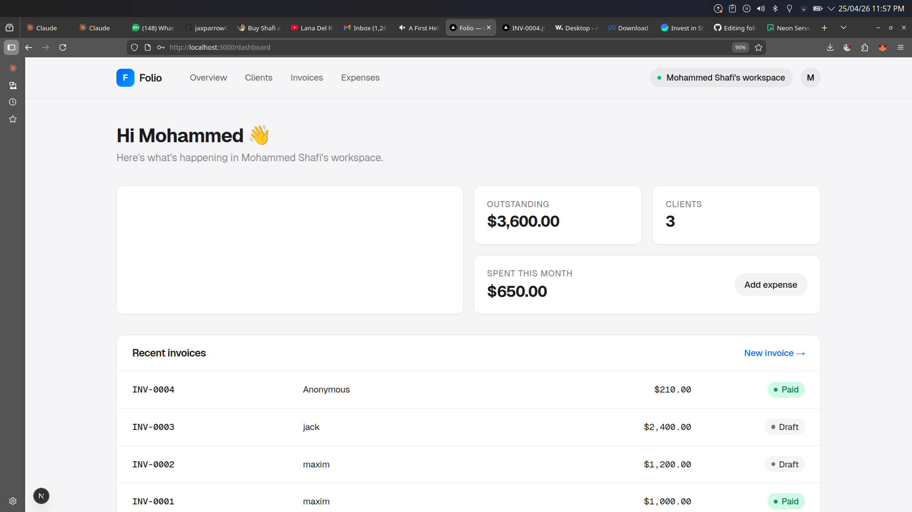
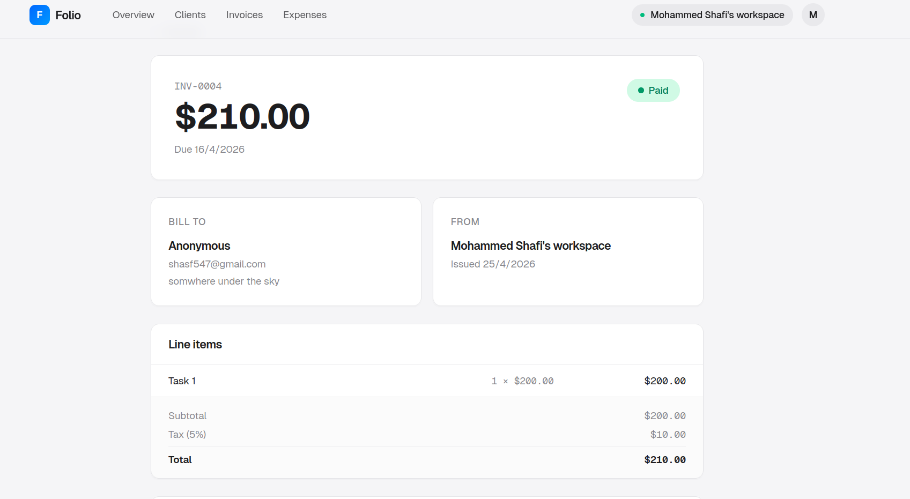

# Folio

**Invoices and expenses, made beautifully simple.**

A multi-tenant SaaS for freelancers — send invoices, track expenses, and let
AI read receipts.

**[→ Live demo](https://folio-saas-one.vercel.app/)**



## Features

- Multi-tenant auth with isolated workspaces (Auth.js v5, JWT)
- Auto-numbered invoices (INV-0001…) with line items, tax, and PDF download
- AI receipt parsing + Zod-typed structured outputs
- Expense tracking with categories and monthly totals
- One workspace per user, created atomically on signup
- Server-rendered React PDFs, downloadable per invoice

## Stack

**Next.js 16** · **TypeScript** · **Tailwind v4** · **Prisma 6** ·
**Auth.js v5** · **@react-pdf/renderer** · **Zod**

## A look around




## How it works

**Multi-tenancy.** Every business-data query goes through a `requireWorkspace()`
helper that resolves the current user's organization and scopes results to it.
The check is enforced at the data-access layer, not in UI logic — so one
workspace's data can't leak into another even if a route forgets to filter.

**AI receipt parsing.** When you upload a receipt image:

1. The file is posted to `/api/expenses/parse-receipt` as base64
2. Claude reads it with vision and returns JSON validated against a Zod schema
3. Vendor / amount / date / category come back typed end-to-end
4. The form pre-fills; you confirm and save

The Zod → JSON-schema bridge means malformed AI responses fail loudly instead
of silently corrupting expense records.

**Workspaces.** On signup, the app creates `User`, `Organization`, and
`Membership` records in a single Prisma transaction. The signing-up user
becomes the owner of their workspace immediately, with no extra clicks.

## Run locally

```bash
git clone https://github.com/Sha547/folio-saas.git && cd folio-saas
npm install
cp .env.example .env
# generate AUTH_SECRET:
node -e "console.log('AUTH_SECRET=' + require('crypto').randomBytes(32).toString('base64'))"
# paste it into .env, then:
npx prisma migrate dev
npm run dev
```

For AI receipt parsing, also set `ANTHROPIC_API_KEY` ([get one](https://console.anthropic.com/)).
Without it, the expense form still works — you just type the fields manually.

## Project structure

```
src/
├── app/
│   ├── (auth)/login, signup     public auth pages
│   ├── (app)/                   protected app (shared layout)
│   │   ├── dashboard/
│   │   ├── clients/
│   │   ├── invoices/
│   │   └── expenses/
│   ├── api/                     PDF, AI parse, file serve
│   └── page.tsx                 marketing landing
├── auth.ts                      Auth.js config
└── lib/
    ├── db.ts                    Prisma singleton
    ├── session.ts               auth helpers
    ├── actions/                 server actions
    └── pdf/                     PDF templates
prisma/
└── schema.prisma                database models
```

## Roadmap

- Invite teammates to a workspace (multi-user orgs)
- Stripe Connect for accepting payments through invoice links
- Resend integration for emailing invoices to clients directly
- Recurring invoices
- OAuth sign-in (Google, GitHub)

---

MIT
