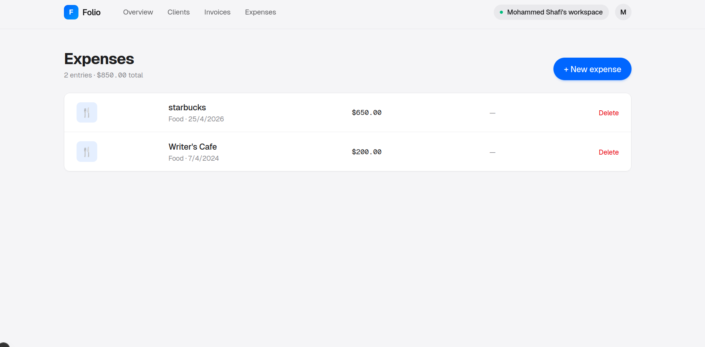

# Folio

**Invoices and expenses, made beautifully simple.**

A multi-tenant SaaS for freelancers — send invoices, track expenses, and let
AI read receipts.



## Features

- Multi-tenant auth with isolated workspaces (Auth.js v5, JWT)
- Auto-numbered invoices with line items, tax, and PDF download
- AI receipt parsing — Claude vision + Zod-typed structured outputs
- Expense tracking with categories and monthly totals
- One workspace per user (created atomically on signup)

## Stack

**Next.js 16** · **TypeScript** · **Tailwind v4** · **Prisma 6** ·
**Auth.js v5** · **Anthropic Claude** · **@react-pdf/renderer** · **Zod**

## Run locally

```bash
git clone https://github.com/Sha547/folio-saas.git && cd folio-saas
npm install
cp .env.example .env
# generate AUTH_SECRET:
node -e "console.log('AUTH_SECRET=' + require('crypto').randomBytes(32).toString('base64'))"
# paste it into .env, then:
npx prisma migrate dev
npm run dev
```

For AI receipt parsing, also set `ANTHROPIC_API_KEY` ([get one](https://console.anthropic.com/)). Without it, expenses can be entered manually.

## Deploy

SQLite for dev, Postgres for prod. Flip `prisma/schema.prisma` provider to
`postgresql`, point `DATABASE_URL` at [Neon](https://neon.tech), and deploy
on Vercel. Receipt storage swaps from local FS to R2/S3 in `src/lib/storage.ts`.

---

MIT
